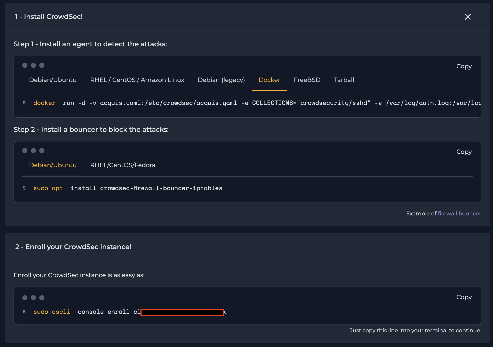
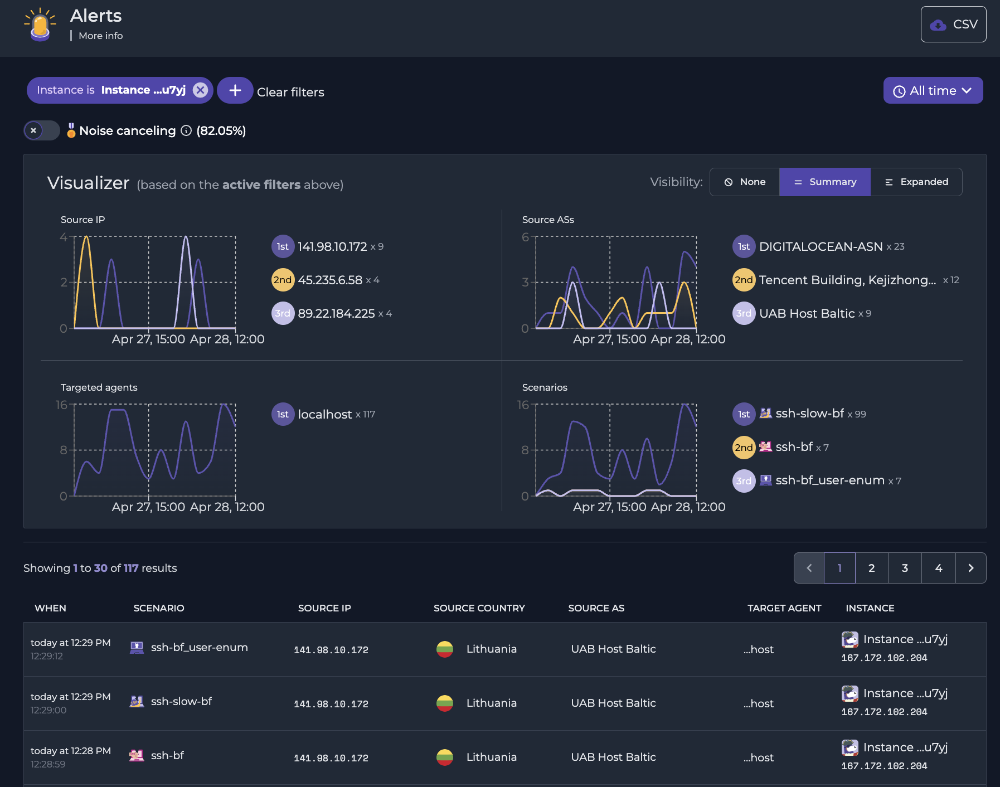

## Secure Traefik with CrowdSec (open-source and collaborative security stack)
This guide shows how to use crowdsec with traefik to secure your web applications. Crowdsec is an open-source and collaborative security stack. It helps you to protect your web applications from attacks. Traefik is a reverse proxy which helps you to route your traffic to the right web application.

[Link to the youtube video](https://youtu.be/Z23BJrRMUM4)

Project structure:
```
.
├── crowdsec_config
│   └── acquis.yml
├── traefik_config
│   ├── dynamic_config.yml
│   └── traefik.yml
├── .env
├── docker-compose.yml
└── README.md
```

## Traefik setup

Head over to my traefik-tutorial folder and follow the instructions there. Make sure to watch the associtaed [youtube video](https://youtu.be/QC3weuCUr8o). Otherwise follow the traefik documentation [here](https://doc.traefik.io/traefik/getting-started/install-traefik/) to get started.

Assumpetions made: 
- We are using the acme tls challenge
- We have the following entrypoints: `websecure` and `web`
- We have the certificate resolver `myresolver`

We extend the traefik configuration to have some configuration files mounted instead of configuring it in the docker-compose.yml file. This way we can easily add new configuration files without changing the docker-compose.yml file and it makes it clearer.

The file [.env](./.env) two folders configured and your domain:
- `DOMAIN`=example.com
- `CROWDSEC_FOLDER`=crowdsec_config
- `TRAEFIK_FOLDER`=traefik_config


Create the directory `traefik_config` with the  following files and add them to the docker-compose.yml volume mount:
 - [dynamic_conf.yml](./traefik_config/dynamic_conf.yml)
 - [traefik.yml](./traefik_config/traefik.yml)

remove the `commands` section from the [docker-compose.yml](./docker-compose.yml) file and add the following volume mounts:

-   ```
    volumes:
      - /etc/localtime:/etc/localtime:ro
      - /var/run/docker.sock:/var/run/docker.sock:ro
      - ./${TRAEFIK_FOLDER}/letsencrypt:/letsencrypt
      - ./${TRAEFIK_FOLDER}/traefik.yml:/traefik.yml:ro
      - ./${TRAEFIK_FOLDER}/dynamic_conf.yml:/dynamic_conf.yml:ro
      - /var/log/crowdsec/traefik/:/var/log/traefik/
    ```
- remove label `middlewares.traefik-auth.basicauth.users`  as it is now covered in the dynamic_conf.yml file
- change label `traefik.middlewares=` to `traefik-auth@file,default@file`

## CrowdSec setup

Create the directory `crowdsec_config` with the file `acquis.yml`. This allows crowdsec to read log files of traefik.
The CrowdSec container needs to be able to read the log files of traefik. Therefore we mount the log directory of traefik(configured in [traefik.yml](./traefik.yml)) to the crowdsec container.
-   ```
    crowdsec:
        container_name: crowdsec
        image: crowdsecurity/crowdsec:latest
        environment:
        PGID: "1000"
        COLLECTIONS: "crowdsecurity/traefik crowdsecurity/http-cve crowdsecurity/whitelist-good-actors"
        volumes:
        - /etc/localtime:/etc/localtime:ro
        - /var/run/docker.sock:/var/run/docker.sock:ro
        - ./crowdsec_config:/etc/crowdsec
        - ./data:/var/lib/crowdsec/data
        - /var/log/auth.log:/var/log/auth.log:ro
        - /var/log/crowdsec:/var/log/crowdsec:ro
        restart: unless-stopped
        security_opt:
        - no-new-privileges=true
        hostname: crowdsec
    ```

We added some preconfigured crowdsourced collections to the environment variable `COLLECTIONS`. You can find more collections [here](https://hub.crowdsec.net/).

CrowdSec is not taking any actions yet, it needs some kind of bouncer to reject any potential attack. There are a few available, we are looking for the [traefik bouncer](https://github.com/fbonalair/traefik-crowdsec-bouncer).


### Crowdsec traefikbouncer

```
  bouncer-traefik:
    container_name: crowdsec-bouncer-traefik
    image: fbonalair/traefik-crowdsec-bouncer:latest
    environment:
      CROWDSEC_BOUNCER_API_KEY: #{CROWDSEC_BOUNCER_API_KEY} # the api key needs to be created of the crowdsec container with `docker compose exec -t crowdsec cscli bouncers add bouncer-traefik`
      CROWDSEC_AGENT_HOST: crowdsec:8080  
    restart: unless-stopped
    depends_on:
      - crowdsec
    hostname: crowdsec-bouncer-traefik
```

Now we need to adapt the [dynamic_conf.yml](./dynamic_conf.yml) with the following additional configuration:
```
    crowdsec-bouncer:
      forwardauth:
        address: http://crowdsec-bouncer-traefik:8080/api/v1/forwardAuth
        trustForwardHeader: true
```
We also need to adapt the [traefik.yml](./traefik.yml) file with the following additional configuration:
```
entryPoints:
  web:
    address: ":80"
  websecure:
    address: ":443"
    http:
      middlewares:
        - crowdsec-bouncer@file
```
That means that every request over the websecure entrypoint will be routed to the crowdsec-bouncer. The crowdsec-bouncer will then check if the request is malicious and if so it will return a 403 status code. If the request is not malicious it will return a 200 status code and the request will be forwarded to the next middleware.
Check your output with `docker exec crowdsec cscli metrics`
Something like this should be shown (after a few days there will be more output):

<details>
  <summary>Click me to expand</summary>

    Acquisition Metrics:
    +------------------------+------------+--------------+----------------+------------------------+
    |         Source         | Lines read | Lines parsed | Lines unparsed | Lines poured to bucket |
    +------------------------+------------+--------------+----------------+------------------------+
    | file:/var/log/auth.log | 17.05k     | 10.32k       | 6.73k          | 31.33k                 |
    +------------------------+------------+--------------+----------------+------------------------+

    Bucket Metrics:
    +-------------------------------------+---------------+-----------+--------------+--------+---------+
    |               Bucket                | Current Count | Overflows | Instantiated | Poured | Expired |
    +-------------------------------------+---------------+-----------+--------------+--------+---------+
    | crowdsecurity/ssh-bf                | -             | 47        | 6.14k        | 10.32k | 6.09k   |
    | crowdsecurity/ssh-bf_user-enum      | -             | 32        | 6.18k        | 6.51k  | 6.14k   |
    | crowdsecurity/ssh-slow-bf           | 1             | 115       | 669          | 10.32k | 553     |
    | crowdsecurity/ssh-slow-bf_user-enum | 1             | 14        | 585          | 4.19k  | 570     |
    +-------------------------------------+---------------+-----------+--------------+--------+---------+

    Parser Metrics:
    +----------------------------------+---------+--------+----------+
    |             Parsers              |  Hits   | Parsed | Unparsed |
    +----------------------------------+---------+--------+----------+
    | child-crowdsecurity/sshd-logs    | 102.53k | 10.32k | 92.21k   |
    | child-crowdsecurity/syslog-logs  | 17.05k  | 17.05k | -        |
    | crowdsecurity/cdn-whitelist      | 117     | 117    | -        |
    | crowdsecurity/dateparse-enrich   | 10.32k  | 10.32k | -        |
    | crowdsecurity/geoip-enrich       | 10.32k  | 10.32k | -        |
    | crowdsecurity/rdns               | 117     | 117    | -        |
    | crowdsecurity/seo-bots-whitelist | 117     | 117    | -        |
    | crowdsecurity/sshd-logs          | 16.95k  | 10.32k | 6.63k    |
    | crowdsecurity/syslog-logs        | 17.05k  | 17.05k | -        |
    | crowdsecurity/whitelists         | 10.32k  | 10.32k | -        |
    +----------------------------------+---------+--------+----------+

    Local Api Metrics:
    +--------------------+--------+------+
    |       Route        | Method | Hits |
    +--------------------+--------+------+
    | /v1/alerts         | GET    | 1    |
    | /v1/alerts         | POST   | 107  |
    | /v1/decisions      | GET    | 1637 |
    | /v1/heartbeat      | GET    | 2438 |
    | /v1/watchers/login | POST   | 44   |
    +--------------------+--------+------+

    Local Api Machines Metrics:
    +-----------+---------------+--------+------+
    |  Machine  |     Route     | Method | Hits |
    +-----------+---------------+--------+------+
    | localhost | /v1/alerts    | GET    | 1    |
    | localhost | /v1/alerts    | POST   | 107  |
    | localhost | /v1/heartbeat | GET    | 2438 |
    +-----------+---------------+--------+------+

    Local Api Bouncers Metrics:
    +-----------------+---------------+--------+------+
    |     Bouncer     |     Route     | Method | Hits |
    +-----------------+---------------+--------+------+
    | bouncer-traefik | /v1/decisions | GET    | 1637 |
    +-----------------+---------------+--------+------+

    Local Api Bouncers Decisions:
    +-----------------+---------------+-------------------+
    |     Bouncer     | Empty answers | Non-empty answers |
    +-----------------+---------------+-------------------+
    | bouncer-traefik | 1635          | 2                 |
    +-----------------+---------------+-------------------+

    Local Api Decisions:
    +---------------------------------------------+----------+--------+-------+
    |                   Reason                    |  Origin  | Action | Count |
    +---------------------------------------------+----------+--------+-------+
    | crowdsecurity/CVE-2022-35914                | CAPI     | ban    | 3     |
    | crowdsecurity/http-sensitive-files          | CAPI     | ban    | 161   |
    | ltsich/http-w00tw00t                        | CAPI     | ban    | 1     |
    | crowdsecurity/CVE-2022-26134                | CAPI     | ban    | 1     |
    | crowdsecurity/CVE-2019-18935                | CAPI     | ban    | 5     |
    | crowdsecurity/CVE-2022-42889                | CAPI     | ban    | 2     |
    | crowdsecurity/apache_log4j2_cve-2021-44228  | CAPI     | ban    | 20    |
    | crowdsecurity/http-backdoors-attempts       | CAPI     | ban    | 91    |
    | crowdsecurity/vmware-vcenter-vmsa-2021-0027 | CAPI     | ban    | 4     |
    | crowdsecurity/http-open-proxy               | CAPI     | ban    | 279   |
    | crowdsecurity/jira_cve-2021-26086           | CAPI     | ban    | 103   |
    | crowdsecurity/spring4shell_cve-2022-22965   | CAPI     | ban    | 3     |
    | crowdsecurity/thinkphp-cve-2018-20062       | CAPI     | ban    | 57    |
    | crowdsecurity/vmware-cve-2022-22954         | CAPI     | ban    | 1     |
    | crowdsecurity/fortinet-cve-2018-13379       | CAPI     | ban    | 22    |
    | crowdsecurity/http-bad-user-agent           | CAPI     | ban    | 4510  |
    | crowdsecurity/http-cve-2021-42013           | CAPI     | ban    | 2     |
    | crowdsecurity/http-generic-bf               | CAPI     | ban    | 10    |
    | crowdsecurity/http-path-traversal-probing   | CAPI     | ban    | 217   |
    | crowdsecurity/ssh-bf_user-enum              | crowdsec | ban    | 1     |
    | crowdsecurity/f5-big-ip-cve-2020-5902       | CAPI     | ban    | 6     |
    | crowdsecurity/http-cve-2021-41773           | CAPI     | ban    | 52    |
    | crowdsecurity/CVE-2022-41082                | CAPI     | ban    | 29    |
    | crowdsecurity/grafana-cve-2021-43798        | CAPI     | ban    | 1     |
    | crowdsecurity/http-crawl-non_statics        | CAPI     | ban    | 504   |
    | crowdsecurity/http-probing                  | CAPI     | ban    | 2877  |
    | crowdsecurity/ssh-bf                        | CAPI     | ban    | 10659 |
    | crowdsecurity/ssh-bf                        | crowdsec | ban    | 1     |
    | crowdsecurity/ssh-slow-bf                   | CAPI     | ban    | 4469  |
    | crowdsecurity/ssh-slow-bf                   | crowdsec | ban    | 9     |
    +---------------------------------------------+----------+--------+-------+

    Local Api Alerts:
    +-------------------------------------+-------+
    |               Reason                | Count |
    +-------------------------------------+-------+
    | crowdsecurity/ssh-bf                | 7     |
    | crowdsecurity/ssh-bf_user-enum      | 7     |
    | crowdsecurity/ssh-slow-bf           | 99    |
    | crowdsecurity/ssh-slow-bf_user-enum | 4     |
    +-------------------------------------+-------+
</details>


## Crowdsec console

You can get a very cool overview of the attacks that are blocked by crowdsec in the console. In order to see that you need an account at [https://www.crowdsec.net/product/console](https://www.crowdsec.net/product/console).
Register an account there and link the console with your instance.

 - 
 
To link the console with the docker container you need to get the shown key from the console and run the following command in the docker container:
`docker exec crowdsec cscli console enroll YourShownKey`

You will get output like this:
```
time="26-04-2023 13:39:24" level=info msg="custom already set to true"
time="26-04-2023 13:39:24" level=info msg="manual set to true"
time="26-04-2023 13:39:24" level=info msg="tainted already set to true"
time="26-04-2023 13:39:24" level=info msg="Enabled tainted&manual alerts sharing, see 'cscli console status'."
time="26-04-2023 13:39:24" level=info msg="Watcher successfully enrolled. Visit https://app.crowdsec.net to accept it."
time="26-04-2023 13:39:24" level=info msg="Please restart crowdsec after accepting the enrollment."
```
Go back to your browser and refresh the site and click `Accept enroll`

Now you can see the blocked attacks in the console and get an amazing dashboard.

Here are some screenshots how it looks like after a few days:
- 
- 